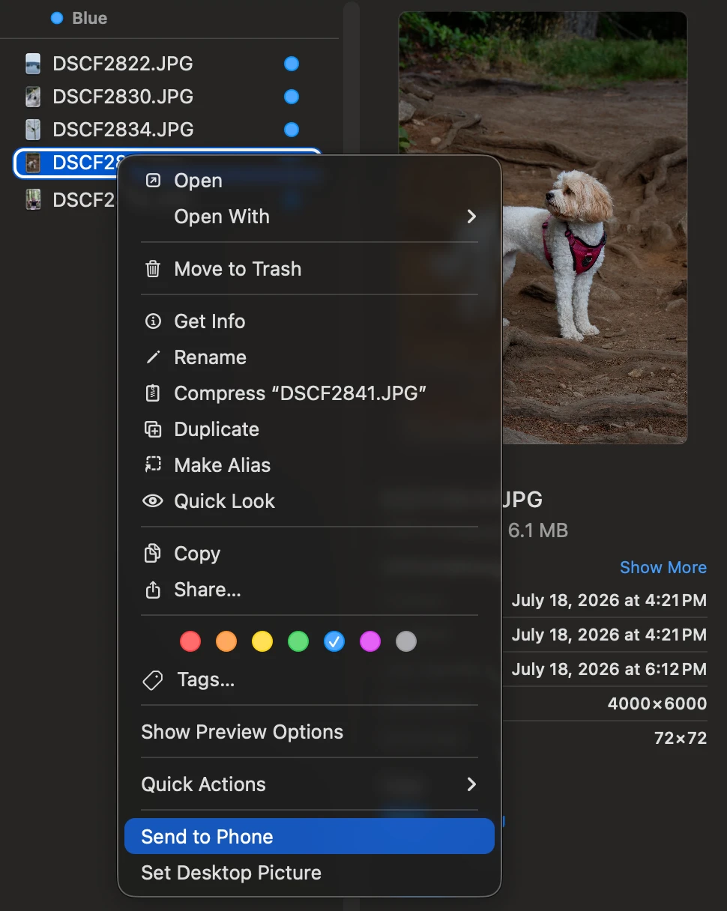

  

# Drawbridge

Right-click a file on your Mac. Send it to your Android phone. That's it.

## The problem

AirDrop does not work with most Android phones. A few new ones (recent Pixels and Samsungs) got it, everyone else is stuck emailing themselves files or plugging in a cable.

## The solution

Drawbridge puts AirDrop's convenience on any Android phone:

- **Send:** select files in Finder, right-click, Send to Phone. Done.
- **Receive:** files from the phone land in `~/Drawbridge` with a notification. A background service is always listening, even after reboots.
- **Nothing to install on the Mac.** No dependencies, no package managers. It runs on the Python that comes with macOS. The phone runs the free [LocalSend](https://localsend.org) app.
- **No cloud.** Everything moves over your Wi-Fi, or the phone's own hotspot with zero internet.

  

## How it works

Drawbridge speaks the same open protocol as the LocalSend app, and wires it into macOS: a right-click menu item for sending and a background service for receiving. Selecting multiple files sends them as one batch with a single prompt on the phone. Files are written to a temp file and renamed only when complete, so a dropped connection never leaves you a half-written fake. Transfers can be encrypted end to end.

## Setup

Phone, once:

1. Install LocalSend, open it, enable Quick Save.
2. Android settings: set LocalSend's battery usage to Unrestricted.

Mac, once:

1. Clone or download this repo.
2. Double-click `Install Right-Click Menu.command` (first run: right-click, Open, Open).
3. Double-click `Install Always-On Receiver.command`.

## Use

- Mac to phone: select files, right-click, Quick Actions, Send to Phone. LocalSend must be open or backgrounded on the phone. Allow the one-time macOS folder permission prompt.
- Phone to Mac: in LocalSend, Send, pick files, choose MacBook. Files arrive in `~/Drawbridge`.
- Scripts: `python3 drawbridge/send_to_phone.py video.mp4 notes.pdf`

## If something fails

| Symptom | Fix |
|---|---|
| Send does nothing | Read `/tmp/drawbridge-send.log`. Usually LocalSend is closed on the phone or the devices are on different networks |
| Nothing arrives on the Mac | `launchctl list \| grep drawbridge` should show 0. Log: `/tmp/drawbridge-receiver.log` |
| Phone never found | Put the phone's IP in `phone.host` in `~/Library/Application Support/drawbridge/config.json` |

## Security

TLS keys are generated locally and never committed. HTTP mode is cleartext on your LAN, so use encryption on both ends if that matters. The receiver accepts files from any LocalSend sender on your network, so do not run it on networks you do not trust.

## License

MIT. Independent project, not affiliated with LocalSend or Apple. AirDrop is a trademark of Apple Inc.
